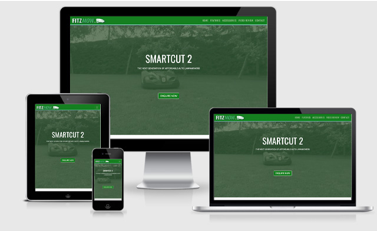

# MSP1
Mile Stone Project 1
<h1 align="center">FITZMOW Landing Page</h1>

This is my first Milestone Project on the Full Stack Web Developer Code Institute course. My aim was to create a landing page for a fictional product that would satisfy the requirements of the project brief but also have the potential for commercial deployment if adapted at a later stage. It is built using HTML, CSS and the Bootstrap 5 Beta framework. The project itself is designed to be front-end only, so back-end functionality does not exist, which includes the form on the contact section. My mentor examined the project at an early stage and deemed that it met the requirements of the brief. 

[View the live project here.](https://niallfitzg.github.io/MSP1/)

<h2 align="center"></h2>

## User Experience (UX)

-   ### User stories

    -   #### First Time Visitor Goals

        1. As a First Time Visitor, I want to be presented with an easy to use navigation so that I can find information about the product
        2. As a First Time Visitor, I want to be able to view easily digestible content so that I can get a product overview
        3. As a First Time Visitor, I want to look for contact information and explore social media links so that I can evaluate this company's trust within the marketplace.

    -   #### Returning Visitor Goals

        1. As a Returning Visitor, I want to confirm the features of the product so I can start making decisions about which company to purchase from
        2. As a Returning Visitor, I want to contact the company so that I can get a quote for the product
  
    -   #### Frequent User Goals
        1. As a Frequent User, I want to use this site to compare this product with other company's products
        2. As a Frequent User, I want to use the social media links to check the company's latest social media posts 
        

-   ### Design
    -   #### Colour Scheme
        -   The colour palette included AO english #157f1f (as used in the company brand logo) and a matched colour Middle-blue-green #a0eade. The colour was matched using (https://coolors.co/)
    -   #### Typography
        -   Oswald is used for headers as it is contemporary and it's proportions convey authority. Roboto is used for body text as it's sans-serif style is clean and easy to read. Sans Serif is the fallback font.
    -   #### Imagery, including Video
        -   Imagery is important in both terms of branding and visual impact. The large, background hero video was retoned in Adobe Premier using the #157f1f green from the palette, for reasons of both branding and filesize optmisation. This more than halved the size of the video. The images were selected for visual impact and adherence to the colour scheme.
   

*   ### Wireframes

    -   Wireframes as 3 page PDF - [View](wireframes/wireframes.pdf)

## Features

-   One page with multiple sections to be responsive on all device sizes
-   Sections include Product Features, Accesories, Video Review and Contact 
-   Footer to include Social media links
-   Self-hosted Hero video that adheres to brand guidelines (Also I intentiionally spaced the Hero text above the approaching lawnmower in the video)
-   Embedded youtube video 
-   Call to Action to direct user to contact section
-   Embedded Google Map
-   Scroll Spy feature to update Nav Bar highlights

## Technologies Used

### Languages Used

-   [HTML5](https://en.wikipedia.org/wiki/HTML5)
-   [CSS3](https://en.wikipedia.org/wiki/Cascading_Style_Sheets)

### Frameworks, Libraries & Programs Used

1. [Bootstrap 5.0.0:](https://getbootstrap.com/docs/5.0/getting-started/introduction/)
    - Bootstrap was used to assist with the responsiveness and styling of the website
1. [Google Fonts:](https://fonts.google.com/)
    - Google fonts 'Oswald' and 'Roboto' were used by importing thourgh the style sheet
1. [Font Awesome:](https://fontawesome.com/)
    - Font Awesome was used in the footer to add icons for aesthetic and UX purposes
1. [Git](https://git-scm.com/)
    - Git was used for version control
1. [GitHub:](https://github.com/)
    - GitHub is used to store the projects code and files
1. [Adobe Photoshop:](https://www.adobe.com/ie/products/photoshop.html)
    - Photoshop was used to resize images and edit photos
1. [Adobe Illustrator:](https://www.adobe.com/ie/products/illustrator.html)
    - Illustrator was used to create the company logo
1. [Adobe Premiere:](https://www.adobe.com/ie/products/premiere.html)
    - Premiere was used to create the video hero
1. [WireFrame Pro:](https://mockflow.com/apps/wireframepro/)
    - WireframePro was used to create the [wireframes](https://github.com/) during the design process.

## Testing

The W3C Markup Validator and W3C CSS Validator Services were used to validate the landing page to ensure there were no syntax errors in the project.

-   [W3C Markup Validator](https://jigsaw.w3.org/css-validator/#validate_by_input) - [Results](assets/images/html_valid.jpg)
-   [W3C CSS Validator](https://jigsaw.w3.org/css-validator/#validate_by_input) - [Results](assets/images/css_valid.jpg)

    

      

### Testing User Stories from User Experience (UX) Section

-   #### First Time Visitor Goals

    1. As a First Time Visitor, I want to be presented with an easy to use navigation so that I can find information about the product.

        1. Upon entering the page, users are presented with a clean navigation bar to go to the section of their choice. Underneath there is a Hero Video with Overlaid Text and a "Get Quote" Call to action button.
        2. The main message of next generation technology and affordabilty is presented on screen.
        3. The user has three options, click the call to action button, scroll down, or use the navigation menu.

    2. As a First Time Visitor, I want to be able to view easily digestible content so that I can get a product overview.

        1. The site has been designed to be fluid, including a scrollspy feature to always indicate in the navigation which section they are currently viewing.
        2. Each section has been designed to show information in a clear and retainable manner, with each information point haveing an associated image.
        3. Customer review information has been presented in a video format, making it easier to absorb than long-winded text.

    3. As a First Time Visitor, I want to look for contact information and explore social media links so that I can evaluate this company's trust within the marketplace.
        1. The contact section is clearly indicated in the navigation, along with a call to action in the hero section that leads to it.
        2. By visiting the "Contact" section, social media links are available to the user in the footer underneath it.

-   #### Returning Visitor Goals

    1. As a Returning Visitor, I want to confirm the features of the product so I can start making decisions about which company to purchase from.

        1. The "Features" section is clearly shown in the navigation bar
   
    2. As a Returning Visitor, I want to contact the company so that I can get a quote for the product

        1. The navigation bar clearly highlights the "Contact Us" section.
        2. The "Get Quote" Call to action in the hero links directly to the "COntact Us" section
        3. The footer contains links to the organisations Facebook, Twitter and LinkedIn pages, which open in new browser tabs
      
-   #### Frequent User Goals

    1. As a Frequent User, I want to use this site to compare this product with other company's products

        1. Being a one-page landing site with easy-to-access sections, it makes the site very easy for the user to keep open in one broswer tab while using other browser tabs to peruse other websites.

    2. As a Frequent User, I want to use the social media links to check the company's latest social media posts 

        1. The user can easily open this website and go directly to the contacts section to check the social media links.

### Further Testing

-   Final testing was carried out using www.lamdatest.com, which enabled tests over a large combination of devices, operating systems and browsers.
-   Testing was performed at each stage of development using Google Chrome Dev Tools.
<h2 align="center"></h2>

### Known Bugs
-   I have noticed that sometimes using the Bootstrap 5 NavBar it might take multiple clicks to bring a section into complete view
-   On Microsoft Internet Explorer and Microsoft Edge some of the media functionality / smooth scrolling does not perform well

## Deployment

### GitHub Pages

The project was deployed to GitHub Pages using the following steps...

1. Log in to GitHub and locate the [GitHub Repository](https://github.com/niallfitzg/MSP1)
2. At the top of the Repeository (not top of page), locate the "Settings" Button on the menu.
3. Scroll down the Settings page until you locate the "GitHub Pages" Section.
4. Under "Source", click the dropdown called "None" and select "Master Branch".
5. The page will automatically refresh.
6. Scroll back down through the page to locate the now published site [link](https://github.com/niallfitzg/MSP1) in the "GitHub Pages" section.

The project was coded at GitPod, whereby commits were pushed to Github frequently using the following methodology:
-   git add . (to add allfiles)
-   git commit -m "descriptive commit message" 
-   git push  (to push to repository)

## Credits

### Code

-   [Bootstrap5](https://getbootstrap.com/docs/4.4/getting-started/introduction/): Bootstrap Library used throughout the project mainly to make site responsive using the Bootstrap Grid System.
-   [Scrollspy](Bootstrap 5 Scrollspy from  https://getbootstrap.com/docs/5.0/components/scrollspy/-->): Bootstrap Scollspy functionality to allow Nav Items to Highlight depending on page position

### Content

-   All descriptive text was taken from [Husqvarna](https://www.husqvarna.com/ie/)

### Media

-  All imagery was taken from [Husqvarna](https://www.husqvarna.com/ie/)

-   The original video used in the header and Video Review section was found on [Youtube](https://www.youtube.com/watch?v=TyC0ijH2pF8&feature=emb_title)

### Acknowledgements

-   My Mentor for continuous helpful feedback.

-  Code Institute for their continuous support in many ways.

-  W3 Schools for reference [here](https://www.w3schools.com/)

